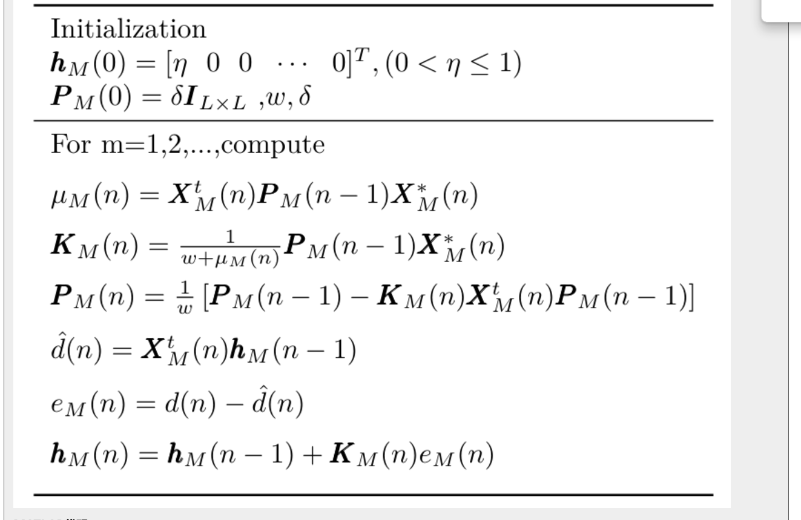

# RLS算法:"rls.hpp"
## 1.理论推导
## 2.仿真及代码解释
## 3.使用场景、方法

---
## 1.理论推导
学习推导参考如下：
1.[自适应滤波之RLS算法（含MATLAB+Python代码）](https://www.cnblogs.com/Qiu-ZM/p/16748735.html)  [注意参考这篇博客使用rls当滤波器时传递函数P_M需除遗传因子，代码有误]  
2.[RLS递归最小二乘法(Recursive Least Squares)](https://blog.csdn.net/u012057432/article/details/125836404?ops_request_misc=%257B%2522request%255Fid%2522%253A%25220E3455A0-EA25-4DFE-B5A1-34795294F712%2522%252C%2522scm%2522%253A%252220140713.130102334..%2522%257D&request_id=0E3455A0-EA25-4DFE-B5A1-34795294F712&biz_id=0&utm_medium=distribute.pc_search_result.none-task-blog-2~all~sobaiduend~default-1-125836404-null-null.142^v100^pc_search_result_base6&utm_term=%E9%80%92%E5%BD%92%E6%9C%80%E5%B0%8F%E4%BA%8C%E4%B9%98%E6%B3%95%20RLS&spm=1018.2226.3001.4187)  
3.[感兴趣可以跟着视频推一遍讲的很清楚](https://www.bilibili.com/video/BV14S4y1T7X6/?spm_id_from=333.337.search-card.all.click&vd_source=e3b5f5510fad0c0b5a26c745e9d9f912)
  
在此直接给出递推结果:  




简化为：
$$
假设 n=4
$$
$$
拟合线性直线为:y=a*x_1+b*x_2+c*x_3+1 = \mathbf{X}_{n \times 1}^\top *\mathbf{h}_{n \times 1}=\begin{vmatrix}x_1 & x_2 & x_3 & 1\\\end{vmatrix}*\begin{vmatrix}a \\b\\c \\ 1 \\\end{vmatrix}  
$$
$$
\mathbf{y}_{1 \times 1}为预测输出，\mathbf{Y}_{1 \times 1}为实际输入，\mathbf{X}_{n \times 1}为RLS的输入矩阵,\mathbf{h}_{n \times 1}为参数向量,\mathbf{K}_{n \times 1}为增益向量，\mathbf{P}_{n \times n}为逆协方差矩阵,w为遗传因子
$$
### 递推开始：
获取增益向量：
$$
\mathbf{K}_{n \times 1} = \frac{\mathbf{P}_{n \times n} \cdot \mathbf{X}_{n \times 1}}{w + \left(\mathbf{X}_{n \times 1}^\top \cdot \mathbf{P}_{n \times n} \cdot \mathbf{X}_{n \times 1}\right)}
$$

获取参数向量:
$$
\mathbf{h}_{n \times 1}+= \mathbf{K}_{n \times 1}\cdot (\mathbf{Y}_{1 \times 1} - (\mathbf{X}_{n \times 1}^\top \cdot\mathbf{h}_{n \times 1} ))
$$

获取逆协方差矩阵：
$$
\mathbf{P}_{n \times n}= \frac{\mathbf{P}_{n \times n} -\mathbf{K}_{n \times 1} \cdot \mathbf{X}_{n \times 1}^\top \cdot \mathbf{P}_{n \times n}}{w}
$$

获得预测输出：
$$
\mathbf{y}_{1 \times 1} = (\mathbf{h}_{n \times 1}^\top \cdot \mathbf{X}_{n \times 1})
$$
以上是关于公式推导的全部介绍。
##
## 2.仿真及代码解释
两个仿真文件均在仓库
仓库地址：[记得star](https://github.com/jqL123XNJTDA/RLS)
rls.m:请注意该仿真是用有噪声输入的连续几点作为输入，而期望输出为无噪声正弦信号，看似是滤波但并不是我们传统意义的滤波，在实际场景中我们并不知道信号无噪声的值，实现不了滤波。
RLS_Predict:  
$$  1.首先将rls_data.csv最后三列的数据以矩阵导入，分别为电机此时的扭矩\mathbf{X}_{1 }，速度\mathbf{X}_{2 }，功率\mathbf{y}_{1 \times 1}$$
 $$2.构建输入向量\mathbf{Z}_{1 } =\mathbf{X}_{1 }* \mathbf{X}_{2 }, \mathbf{Z}_{2 } =\mathbf{X}_{2 }* \mathbf{X}_{2 },\mathbf{Z}_{3} =\mathbf{X}_{1 }* \mathbf{X}_{1 },\mathbf{X}_{4 \times 1 }= \begin{vmatrix}\mathbf{Z}_{1 } \\\mathbf{Z}_{2}\\\mathbf{Z}_{3 }\\ 1 \\\end{vmatrix}  $$
$$
 3.递归计算
$$
### rls类使用
```cpp
 // 初始化 RLS 参数
float delta = 1000.0f;
float lambda = 0.6f;

// 创建 RLS 类的实例
RLS<4> rls(delta, lambda);
Matrixf<4, 1> sampleVector;//输入dim*1的矩阵
sampleVector[0][0] = 1.0f;
sampleVector[1][0] = 2.0f;
sampleVector[2][0] = 3.0f;
sampleVector[3][0] = 4.0f;
float actualOutput = 10.0f;//期望输出
rls.update(sampleVector, actualOutput);//rls递归
float out=rls.output;//得到预测输出
```

## 3.使用场景、方法
引入RLS目的在于实时改变参数，已达在不同状态和时间预测下时刻不同输入时的输出。  
在功率控制中，输入此时刻的电机转速，扭矩，期望输出为此时功率，可得到此时的线性参数，预测在下时刻增大转速扭矩是否超功率，如超功率则进一步功率控制。


